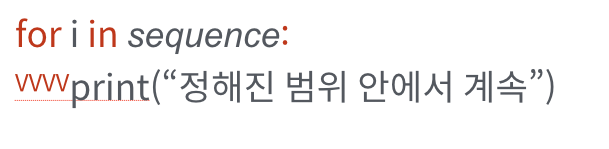
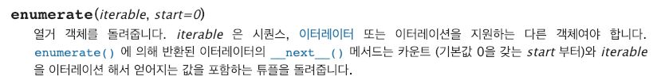

# 1. python basic

## 조건문

    지금까지의 코드는 위에서부터 아래로 순차적으로 명령을 수행하는 프로그램을 작성하였다.

    제어문(Control of Flow)은 크게 반복문과 조건문으로 나눌 수 있고, 이는 순서도(Flow chart로 표현이 가능하다.)

    

    ```python
    # 위의 flow chart로 표현하면 아래와 같다.
    a = 5
    if a > 5:
        print("5 초과")
    else:
        print("5 이하")
    print(a)
    ```

### 조건문 문법

if 문은 ***반드시 일정한 참/거짓을 판단*** 할 수 있는 조건식과 함께 사용이 되어야한다.

```
if <조건식>:
2-1. <조건식>이 참인 경우 : 이후의 문장을 수행한다.

2-2. <조건식>이 거짓인 경우 else: 이후의 문장을 수행한다.
```

이때 반드시 `들여쓰기`를 유의해야한다. 파이썬에서는 코드 블록을 자바나 C언어의 {}와 달리 들여쓰기로 판단하기 때문이다.
앞으로 우리는 `PEP-8`에서 권장하는 `4spaces`를 사용할 것이다.

```python
num = int(input("점수를 입력하세요 : "))
# 아래에 코드를 작성하세요.
print(num)
if num % 2 == 0:
    print("짝수입니다.")
else :
    print("홀수입니다.")
```

### 복수 조건문

2개 이상의 조건문을 활용할 경우 elif <조건식>:을 활용한다.

```python
score = int(input("점수를 입력하세요 : "))
if score >= 90:
    print("A")
elif score >= 80:
    print("B")
elif score >= 70:
    print("C")
elif score >= 60:
    print("D")
else :
    print("F")
```

### 조건 활용식

활용법

```
true_value if <조건식> else false_value
```
와 같이 표현식을 작성할 수 있다. 

이는 보통 다른 언어에서 활용되는 삼항연산자와 동일하다.

```java
int num = 1
boolean isOdd = num % 2 == 1 ? true : false; 
// 홀수인지 짝수인지 구분하는 변수 isOdd
```

다른 언어에서는 위 자바코드처럼 삼항연산자를 사용한다. python에서는 아래와 같이 삼항연산자를 조건표현식으로 표현한다.

```python
num = 1
is_odd = True if num % 2 == 1 else False
# 홀수인지 짝수인지 구분하는 변수 is_odd
```

## 반복문

Python에서는 반복문으로 `while`과 `for`를 지원해준다.

### while 문

while문은 조건식이 참(True)인 경우 반복적으로 코드를 실행한다.


> while문은 종료조건을 반드시 지정해야만 한다.

```python
a = 0
while a < 5:
    print(a)
    a += 1
print("끝")
```
위는 python의 while문 예시이다.

while과 콜론`:` 사이에 while 문에 조건식을 넣어준다.

`while <조건식> :` 아래는 코드블록이 오며 `4spaces`로 들여쓰기해야만 한다.

### for 문

`for문`은 정해진 범위 내(시퀀스)에서 순차적으로 코드를 실행한다.



```python
for variable in sequence:
    code line1
    code line2
```

`for`문은 `sequence`를 순차적으로 `variable`에 값 바인딩을 하며 코드 블록을 시행한다.

```python
# 반복문과 조건문 이용하여 1~30 중 홀수만 담긴 리스트 만들기
l = list(range(1, 31))
answer = []
for i in l:
    if i % 2 != 0:
        answer.append(i)
print(answer)
```

### index와 함께 for문 사용하기

`enumerate()`를 활용하여 추가적인 변수를 활용할 수 있다.



```python
lunch = ['짜장면', '초밥']
e = enumerate(lunch)
for i in e:
    print(i)
# (0, '짜장면'), (1, '초밥') 이 출력
```

위 예시 같이 index와 value를 튜플 형태로 제공해준다.

### Dictionary 반복문 활용


# 2. Node.js

Node.js는 자바스크립트를 브라우저 외에 다른 환경 (서버, 응용프로그램, 블록체인, 임베디드 등)에서도 사용할 수 있게 해주는 `런타임`

> 런타임? (runtime?)
>
> 런타임이란 특정 언어로 만든 프로그램을 **실행 할 수 있는 환경**을 의미한다. 즉, `Node.js`는 javascript 프로그램을 실행할 수 있는 환경이라는 뜻이다.

주로 `Node.js`는 `http 서버`가 내장되어있기 때문에 서버로 많이 사용된다.

```javascript
var http = require("http"); // http 모듈 가져오기
var server = http.createServer(function(req, res){
   console.log("server start!") 
}); // 서버 생성
server.listen(3000); // port 3000번으로 서버 실행
```

## Chrome V8 Engine

Node.js는 구글에서 만든 `javascript` 엔진으로 웹 브라우저를 만드는 데 기반을 제공하는 오픈소스 엔진이다. (구글 크롬 브라우저와 안드로이드 브라우저에 탑재)

[위키백과](https://ko.wikipedia.org/wiki/%ED%81%AC%EB%A1%AC_V8)

[Chrome V8 엔진 참고](http://thd0011.tistory.com/20)

[captain pangyo님의 어플리케이션 성능 향상 기법](https://joshuajangblog.wordpress.com/2016/07/30/chrome-v8-javascript-perf/)

[javascript 작동 원리 + 최적화된 코드 작성 팁](https://engineering.huiseoul.com/%EC%9E%90%EB%B0%94%EC%8A%A4%ED%81%AC%EB%A6%BD%ED%8A%B8%EB%8A%94-%EC%96%B4%EB%96%BB%EA%B2%8C-%EC%9E%91%EB%8F%99%ED%95%98%EB%8A%94%EA%B0%80-v8-%EC%97%94%EC%A7%84%EC%9D%98-%EB%82%B4%EB%B6%80-%EC%B5%9C%EC%A0%81%ED%99%94%EB%90%9C-%EC%BD%94%EB%93%9C%EB%A5%BC-%EC%9E%91%EC%84%B1%EC%9D%84-%EC%9C%84%ED%95%9C-%EB%8B%A4%EC%84%AF-%EA%B0%80%EC%A7%80-%ED%8C%81-6c6f9832c1d9)