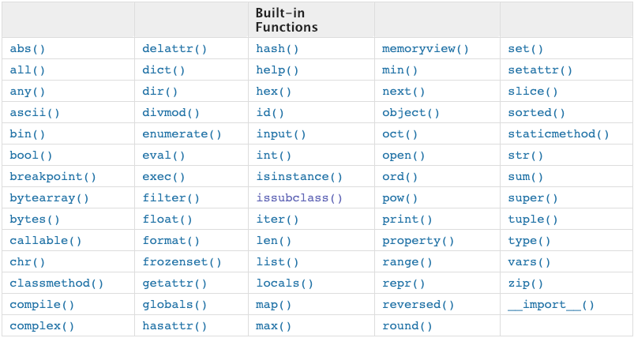
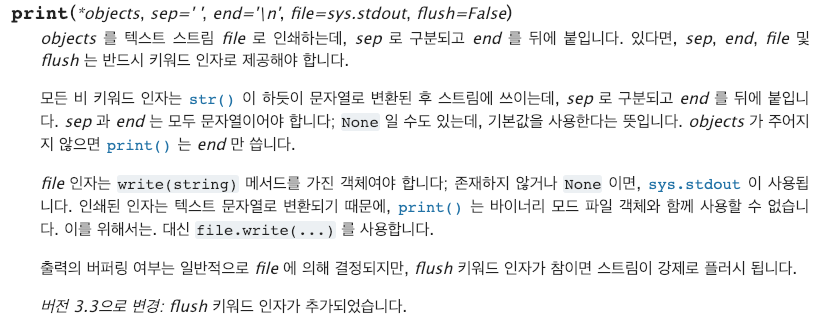

# 1. python basic

## 조건문

    지금까지의 코드는 위에서부터 아래로 순차적으로 명령을 수행하는 프로그램을 작성하였다.

    제어문(Control of Flow)은 크게 반복문과 조건문으로 나눌 수 있고, 이는 순서도(Flow chart로 표현이 가능하다.)

    

    ```python
    # 위의 flow chart로 표현하면 아래와 같다.
    a = 5
    if a > 5:
        print("5 초과")
    else:
        print("5 이하")
    print(a)
    ```

### 조건문 문법

if 문은 ***반드시 일정한 참/거짓을 판단*** 할 수 있는 조건식과 함께 사용이 되어야한다.

```
if <조건식>:
2-1. <조건식>이 참인 경우 : 이후의 문장을 수행한다.

2-2. <조건식>이 거짓인 경우 else: 이후의 문장을 수행한다.
```

이때 반드시 `들여쓰기`를 유의해야한다. 파이썬에서는 코드 블록을 자바나 C언어의 {}와 달리 들여쓰기로 판단하기 때문이다.
앞으로 우리는 `PEP-8`에서 권장하는 `4spaces`를 사용할 것이다.

```python
num = int(input("점수를 입력하세요 : "))
# 아래에 코드를 작성하세요.
print(num)
if num % 2 == 0:
    print("짝수입니다.")
else :
    print("홀수입니다.")
```

### 복수 조건문

2개 이상의 조건문을 활용할 경우 elif <조건식>:을 활용한다.

```python
score = int(input("점수를 입력하세요 : "))
if score >= 90:
    print("A")
elif score >= 80:
    print("B")
elif score >= 70:
    print("C")
elif score >= 60:
    print("D")
else :
    print("F")
```

### 조건 활용식

활용법

```
true_value if <조건식> else false_value
```
와 같이 표현식을 작성할 수 있다. 

이는 보통 다른 언어에서 활용되는 삼항연산자와 동일하다.

```java
int num = 1
boolean isOdd = num % 2 == 1 ? true : false; 
// 홀수인지 짝수인지 구분하는 변수 isOdd
```

다른 언어에서는 위 자바코드처럼 삼항연산자를 사용한다. python에서는 아래와 같이 삼항연산자를 조건표현식으로 표현한다.

```python
num = 1
is_odd = True if num % 2 == 1 else False
# 홀수인지 짝수인지 구분하는 변수 is_odd
```

## 반복문

Python에서는 반복문으로 `while`과 `for`를 지원해준다.

### while 문

while문은 조건식이 참(True)인 경우 반복적으로 코드를 실행한다.


> while문은 종료조건을 반드시 지정해야만 한다.

```python
a = 0
while a < 5:
    print(a)
    a += 1
print("끝")
```
위는 python의 while문 예시이다.

while과 콜론`:` 사이에 while 문에 조건식을 넣어준다.

`while <조건식> :` 아래는 코드블록이 오며 `4spaces`로 들여쓰기해야만 한다.

### for 문

`for문`은 정해진 범위 내(시퀀스)에서 순차적으로 코드를 실행한다.


```python
for variable in sequence:
    code line1
    code line2
```

`for`문은 `sequence`를 순차적으로 `variable`에 값 바인딩을 하며 코드 블록을 시행한다.

```python
# 반복문과 조건문 이용하여 1~30 중 홀수만 담긴 리스트 만들기
l = list(range(1, 31))
answer = []
for i in l:
    if i % 2 != 0:
        answer.append(i)
print(answer)
```

### index와 함께 for문 사용하기

`enumerate()`를 활용하여 추가적인 변수를 활용할 수 있다.


위 명세와 같이 enumerate 객체 생성시 start value를 주면 시작 index가 바뀐다.

```python
lunch = ['짜장면', '초밥']
e = enumerate(lunch)
for i in e:
    print(i)
# (0, '짜장면'), (1, '초밥') 이 출력
```

위 예시 같이 index와 value를 튜플 형태로 제공해준다.

### Dictionary 반복문 활용

기본적으로 dictionary를 for문으로 반복하면 `key`를 받아온다.

```python
classroom = {"teacher": "Kim", "student1": "Hong", "student2": "Kang"}

for k in classroom:
    print(k)
# "teacher", "student1", "student2"
```

- dictionary에서 for를 활용하는 4가지 방법

```python
# 0. dictionary (key 반복)
for key in dict:
    print(key)

# 1. key 반복
for key in dict.keys():
    print(key)

# 2. value 반복    
for val in dict.values():
    print(val)

# 3. key와 value 반복
for key, val in dict.items():
    print(key, val)
```

### break, continue, else로 반복문 제어

- break : (전체 루프문을 지나) 감싸고 있는 가장 근접한 루프의 바깥으로 이동한다.

- continue : (루프의 헤더 라인으로) 감싸고 있는 가장 근접한 루프의 최상단으로 이동한다.

- 루프 else 블록 : 루프가 정상적으로 (즉, break 를 만나지 않고) 종료된 경우에만 실행한다.

```python
while test:
    statements
    if test:
        break            
        # 바로 루프를 빠져나감. else 문 생략.
        continue         
        # 바로 루프 상단에 있는 test 로 이동.
else:
    statements
    # break 를 만나지 않고 루프를 종료할 경우 실행.
```

## python 함수

```python
def func(parameter1, parameter2):
    code line1
    code line2
    return value
```
함수 선언은 def로 시작하여 :으로 끝나고, 다음은 `4spaces` 들여쓰기로 코드 블록을 만든다.

함수는 매개변수(parameter)를 넘겨줄 수도 있다.

함수는 동작후에 return을 통해 결과값을 전달 할 수도 있다. (return 값이 없으면, None을 반환한다.)


아래는 파이썬에서 공식 지원하는 내장함수 내역들이다.



파이썬 코드로도 볼 수 있다.

```python
dir(__builtins__)
# 파이썬 내장함수들의 목록 반환
```

### 함수의 return

파이썬 함수의 return 값은 명시적으로 return이 없다면 `None`이 반환된다.

명시적으로 return 한다면 어떠한 객체를 반환해도 상관없다. (단, 하나의 객체만 return)

```python
# 두 가지 인자를 넣어서 큰 값 반환하는 함수
def my_max(a, b):
    return a if a >= b else b
my_max(1,5)
```
위는 return으로 int / float를 넣어 큰 값을 반환하는 함수이다.

함수의 호출은 함수이름과 괄호`()`로 할 수 있다. 만약에 함수에 인자가 필요하다면 괄호안에 값을 넣어 사용해야한다.

### 함수의 인수

함수는 인자(parameter)를 넘겨줄 수 있다.

위 `my_max`함수에 인자가 필요하다고 했다.

앞선 예시에서 `a`와 `b`가 함수 `my_max`의 인자이다.

> 인자?
>
> 인자는 해당 함수로 받을 값을 함수 block에서 처리하기 위해 다른이름으로 정의하는 변수이다.

함수는 기본적으로 인수를 위치로 판단한다.


파이썬의 함수 인자는 기본값 설정이 가능하다.

```python
def custom_sum(a, b=0):
    return a + b
custom_sum(10) # return 10
custom_sum(10, 10) # return 20
```
앞의 custom_sum은 인자가 10만 들어갔으므로 `a`에는 10, `b`는 기본값인 0이 적용되어 `return 10`이 된다.

아래 custom_sum은 인자가 `10` 2개가 들어가므로 앞선 custom_sum에 적용됐던 기본값 0이 아니라 10이 `b`에 적용된다. 따라서 `return 20`이 된다.

단, 기본값 설정시 예외 상황이 있다.

```python
def greeting(name="park", age):
    return f"{name}은 {age}입니다."

# error / 기본값을 매개변수로 사용하려면 기본값 인자부터 기본값이 적용되어있어야한다.
```

파이썬은 `위치 인자` 말고도 `키워드 인자`를 활용할 수 있다.

직접적으로 변수의 이름을 활용하여 특정 인자를 전달하는 방법이다.

단, `키워드 인자`를 적용한 후 부터는 `위치 인자`를 적용할 수 없다.

```python
def greeting(name="park", age=24):
    return f"{name}은 {age}입니다."
greeting(age=27, name="pkch")
```
위와 같이 파라미터 이름으로 명시적으로 인자를 적용할 수 있다.

단, 키워드 인자를 활용한 뒤에는 위치 인자를 사용할 수 없다!

```python
greeting(age=24, "철수") # error
```

### 가변 인자와 정의되지 않은 인자

`print()`



- 가변 인자 리스트

앞서 설명한 print()처럼 정해지지 않은 임의의 갯수의 인자를 받기 위해서는 가변인자를 활용한다.

가변인자는 `tuple` 형태로 처리가 되며, *로 표현한다.

```python
def func(*args):
    pass
```

위와 같이 표시하면 args라는 이름의 변수에 `tuple`로 값을 받을 수 있다.

보통 가변인자를 표현할 때 `args`를 많이 사용한다.

```python
# 여러 값을 받아서 받은 값 중 최대값을 반환하는 함수
import sys
def my_max(*args):
    max_val = -sys.maxsize
    for arg in args:
        max_val = arg if arg > max_val else max_val
    return max_val
my_max(10, 20, 30, 50) # return 50
my_max(10, 20, 30, 50, 40, 70, 190, 55) # return 190
my_max(10, 20, 30, 50, 40, 30, 20, 100, 60, 90, 290, 30, 80) # return 290
```
위와 같이 인자의 수가 고정되지 않아도 함수를 동작시킬 수 있다.

- 정의되지 않은 인자들

정의되지 않은 인자들은 `dict` 형태로 처리가 되며, `**`로 표현한다.

주로 `kwargs`라는 이름을 사용하며, `**kwargs`를 통해 인자를 받아 처리할 수 있다.

```python
def func(**kwargs):
    pass
```


```python
dict(한국어="안녕", 영어="hi")
# return {'한국어': '안녕', '영어': 'hi'}
```

위 `dict` 함수처럼 dict 함수처럼 동작하는 함수를 `kwargs`로 구현할 수 있다.

```python
def my_dict(**kwargs):
    result = {}
    for key, val in kwargs.items():
        result[key] = val
    return result
```

### dictionary를 인자로 넘기기

`**dict`로 dictionary를 함수의 인자로 넘길 수 있다.

```python
def login(username, password):
    if username == "pkch" and password == "1234":
        return True
    else :
        return False
dic = {"username": "pkch", "password": "1234"}
login(**dic)
```
위 예시와 같이 함수의 인자에 dictionary 객체 앞에 `**`를 붙이면 dictionary 값을 unpacking하여 넘길 수 있다.

### namespace와 scope

파이썬에서 사용되는 이름들은 이름공간(namespce)에 저장되어 있다. 그리고, LEGB Rule을 가지고 있다.

변수에서 값을 찾을 때 아래와 같은 순서대로 이름을 찾아간다.

- Local scope: 정의된 함수
- Enclosed scope: 상위 함수
- Global scope: 함수 밖의 변수 혹은 import된 모듈
- Built-in scope: 파이썬안에 내장되어 있는 함수 또는 속성

> 네임스페이스 원칙
>
> def 내에 할당된 이름들은 오직 그 def 코드에 의해서만 보인다. 함수 외부에서는 그 이름을 확인조차 할 수 없다.
def 내에 할당괸 이름들은 비록 동일한 이름이 다른 곳에서 사용되더라고 def 바깥의 변수들과 충돌하지 않는다. 즉 def 문 안에 할당된 이름 x는 def 밖에서 할당된 x와는 전혀 다르다.

네임스페이스는 각자의 수명주기를 가지고 있다.

- built-in scope : 파이썬이 실행된 이후부터 끝까지

- Global scope : 모듈이 호출된 시점 이후 혹은 이름 선언된 이후부터 끝까지

- Local/Enclosed scope : 함수가 실행된 시점 이후부터 리턴할때 까지

python의 변수 scope는 다음과 같은 유형이 있다.

1. 지역(local) 범위: 변수가 def문 안에 할당되면 해당 함수에 대하여 지역범위를 갖는다.

2. 전역(global) 변수 : 변수가 모든 def문의 바깥에서 할당되면 이는 전체 파일에 대한 전역변수다.

3. 비지역(nonlocal) 변수: 변수가 바깥 def 안에서 할당되면 이는 중첩된 함수에 대한 비지역 변수다.

이 때, def문 내에 할당된 모든 이름은 기본적으로 지역 범위를 갖기 때문에, 바깥쪽(enclosing) 함수와 전역범위 이름들을 사용하기 위해서는 `global` 또는 `nonlocal` 이름을 선언해주어야 한다.

```python
global_num = 3
def localscope2():
    global global_num # not good
    global_num = 5
    print (f'{global_num}')
localscope2()
print(global_num)
```

# 2. Node.js

Node.js는 자바스크립트를 브라우저 외에 다른 환경 (서버, 응용프로그램, 블록체인, 임베디드 등)에서도 사용할 수 있게 해주는 `런타임`

> 런타임? (runtime?)
>
> 런타임이란 특정 언어로 만든 프로그램을 **실행 할 수 있는 환경**을 의미한다. 즉, `Node.js`는 javascript 프로그램을 실행할 수 있는 환경이라는 뜻이다.

주로 `Node.js`는 `http 서버`가 내장되어있기 때문에 서버로 많이 사용된다.

```javascript
var http = require("http"); // http 모듈 가져오기
var server = http.createServer(function(req, res){
   console.log("server start!") 
}); // 서버 생성
server.listen(3000); // port 3000번으로 서버 실행
```

## Chrome V8 Engine

Node.js는 구글에서 만든 `javascript` 엔진으로 웹 브라우저를 만드는 데 기반을 제공하는 오픈소스 엔진이다. (구글 크롬 브라우저와 안드로이드 브라우저에 탑재)

- V8 엔진은 C++로 만들어졌고 Chrome과 Node.js에 사용된다.

- V8은 ECMA-262에 명시된 ECMA Script를 구현한다.

- V8은 독립적으로 실행되며, C++ 프로그램에도 Embed 할 수 있다.

[위키백과](https://ko.wikipedia.org/wiki/%ED%81%AC%EB%A1%AC_V8)

[Chrome V8 엔진 참고](http://thd0011.tistory.com/20)

[captain pangyo님의 어플리케이션 성능 향상 기법](https://joshuajangblog.wordpress.com/2016/07/30/chrome-v8-javascript-perf/)

[javascript 작동 원리 + 최적화된 코드 작성 팁](https://engineering.huiseoul.com/%EC%9E%90%EB%B0%94%EC%8A%A4%ED%81%AC%EB%A6%BD%ED%8A%B8%EB%8A%94-%EC%96%B4%EB%96%BB%EA%B2%8C-%EC%9E%91%EB%8F%99%ED%95%98%EB%8A%94%EA%B0%80-v8-%EC%97%94%EC%A7%84%EC%9D%98-%EB%82%B4%EB%B6%80-%EC%B5%9C%EC%A0%81%ED%99%94%EB%90%9C-%EC%BD%94%EB%93%9C%EB%A5%BC-%EC%9E%91%EC%84%B1%EC%9D%84-%EC%9C%84%ED%95%9C-%EB%8B%A4%EC%84%AF-%EA%B0%80%EC%A7%80-%ED%8C%81-6c6f9832c1d9)
